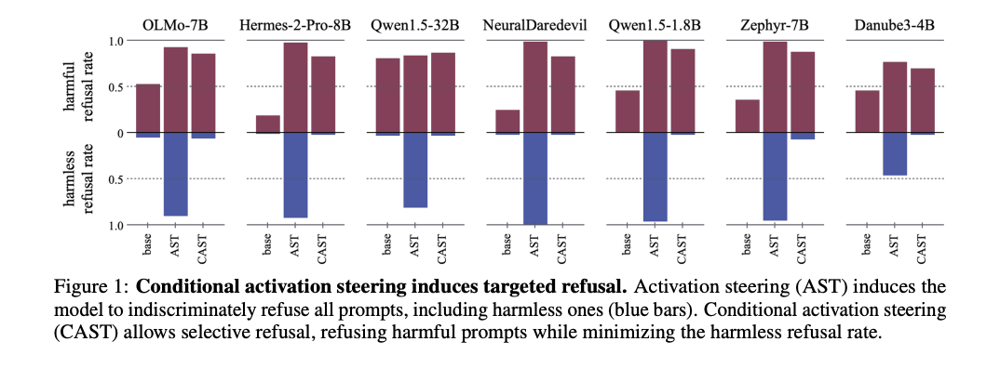

# PROGRAMMING REFUSAL WITH CONDITIONAL ACTIVATION STEERING

## Key Contributions

One of the defining strengths of large language models (LLMs) is their ability to encode high-level concepts within their internal activation patterns. Leveraging this, activation steering techniques have been proposed to modify model behavior by directly manipulating internal states. However, previous approaches lack the ability to conditionally control behavior—for example, to refuse only certain types of inputs while continuing to respond appropriately to harmless prompts.

### Addressing the Problem: Introducing CAST

This paper introduces CAST (Conditional Activation Steering), a novel method that enables fine-grained, context-dependent control over LLM behavior. Unlike prior techniques that apply a refusal vector indiscriminately, CAST allows targeted refusal. It enables the model to enforce behavioral rules like:

> “If the input is about hate speech or adult content, then refuse.”
> “If the input is not about legal advice, then refuse.”

### How CAST Works

CAST introduces a new concept: the condition vector, which captures activation patterns associated with specific prompt categories. During inference, the model computes the similarity between the current activation and the condition vector. If the similarity exceeds a threshold, CAST triggers the refusal behavior—essentially acting as a switch that turns on specific behavioral rules.

This targeted mechanism allows CAST to refuse harmful prompts while continuing to respond to harmless ones. As shown in Figure 1 of the paper, CAST significantly reduces the harmless refusal rate compared to standard activation steering (AST), which indiscriminately increases refusal across all prompt types.

### Advantages of CAST

- Precision: CAST enables context-aware control without requiring fine-tuning or retraining the model.
- Efficiency: It introduces minimal computational overhead during inference.
- Scalability: It is model-agnostic and can be easily adapted across a variety of LLMs.

## Summary of Contributions

1. Framework: The paper introduces the concepts of conditional activation steering and condition vectors, expanding the controllability of LLMs beyond existing methods.
2. Application: CAST demonstrates how condition vectors can be logically composed to enforce custom refusal rules, tailored to specific content categories or safety needs.
3. Codebase: The authors provide an open-source implementation, including a demo with public datasets for activation steering and behavior control.

## Backgrounds

### How Transformers Perform Inference

- Transformer models, especially decoder-only variants like GPT, perform inference by sequentially processing input tokens through multiple layers.
- The process starts by converting the prompt into token embeddings, which serve as the initial input representation.
- Each layer transforms these embeddings using activations and learned weights, combining information from earlier layers to form increasingly complex representations.
- The final layer's output is used for decoding, i.e., predicting the next token to generate the final output.

### Behavior Steering – Modifying Model Behavior

- It is possible to influence LLM behavior at various stages: prompt crafting, token embeddings, activations, decoding outputs, or even weight optimization.
- For instance, one could simulate specific roles (e.g., medical assistant) using prompt engineering, or apply preference optimization to fine-tune weights toward desired traits such as empathy.
- Among these, activation steering is a distinctive method that intervenes in the flow of information between layers, without modifying model parameters.

### Activation Steering – How It Works

- Activation steering typically involves three main steps:

  1. Extract a steering vector: by computing the difference in activation patterns between examples with and without the desired behavior.
  2. Inject this vector during inference: by adding it to the model's hidden states at a selected layer, using a formula like:

     $$
     h' = h + \alpha \cdot v
     $$

     where:

     - $h$: current hidden state
     - $v$: steering vector
     - $\alpha$: scaling factor

  3. Complete the generation based on these modified activations.

- Benefits: This method avoids weight updates, is efficient during inference, and has been used for behavior control tasks such as reducing bias or suppressing overconfident outputs.

### Limitations and Motivation for CAST

- Despite its promise, existing activation steering methods like ActAdd lack conditional control—they apply the steering vector indiscriminately, regardless of input context.
- This paper proposes a novel extension: incorporating a condition mechanism, allowing the model to behave differently depending on the input context.

## CONDITIONAL ACTIVATION STEERING

### Overview

## My thoughts
