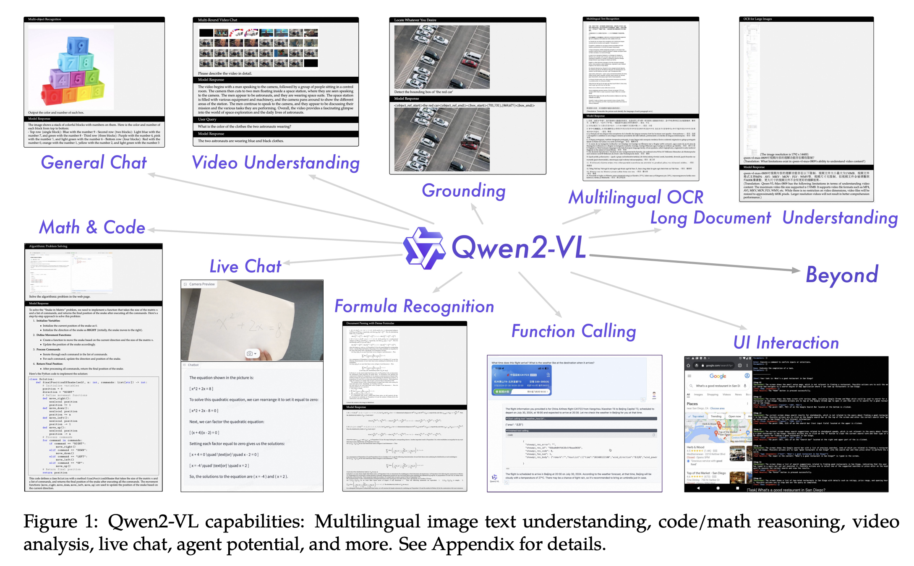

## Problem statement

In recent years, large vision-language models (LVLMs) have advanced significantly, extending traditional large language models (LLMs) to handle multimodal data such as images, audio, and video. These models can encode complex visual and textual information, enabling deeper integration of real-world sensory understanding into AI systems. However, despite their progress, current LVLMs still face several key limitations:

1. **Fixed input resolution constraints**: Most LVLMs process images at a fixed resolution (e.g., 224×224), which simplifies training but leads to information loss in high-resolution inputs. This one-size-fits-all approach prevents the model from capturing fine-grained visual details and scaling sensitivity comparable to human perception.

2. **Static, frozen vision encoders**: Many models rely on frozen CLIP-style visual encoders, which restrict adaptability. These frozen representations often fail to generalize well to complex reasoning tasks or images with intricate details, limiting multimodal comprehension.

3. **Limited adaptation across scales and modalities**: Existing LVLMs are generally not optimized for dynamic resolution learning or cross-scale adaptability, causing inefficiency in handling images of varying sizes or spatial complexity.

4. **Inadequate handling of temporal dynamics in videos**: Most LVLMs treat video as a sequence of independent frames, ignoring the temporal continuity crucial for understanding motion and real-world dynamics. The reliance on 1D positional embeddings further limits the capacity to model 3D spatial and temporal relationships.

5. **Scaling laws and efficiency gaps**: While LLM scaling laws are well understood, scaling behaviors for LVLMs remain underexplored. How model and data size affect multimodal performance is still an open research question.

## Research contributions

To overcome these challenges, the paper introduces Qwen2-VL, a new family of large vision-language models that significantly enhances multimodal understanding and efficiency. The key innovations and contributions are as follows:

1. **Introduction of dynamic resolution and multimodal rotary position embedding (M-RoPE)**

- The authors propose dynamic resolution training for the vision transformer (ViT), enabling the model to adapt to different input resolutions without losing fine details.
- They further develop M-RoPE, which integrates 2D spatial and 3D temporal embeddings, allowing the model to process both static images and dynamic videos seamlessly.

2. **Three scalable open-weight models**

The paper releases the Qwen2-VL family in three model sizes:

- Qwen2-VL-2B (efficient, for limited resources)
- Qwen2-VL-7B (performance-optimized)
- Qwen2-VL-72B (most capable, for complex reasoning and agent tasks)

All models share a 675M-parameter vision encoder and differ in their LLM size (1.5B–72B parameters).

3. **Unified and robust architecture**

The models adopt a visual encoder → cross-modal connector → LLM framework, incorporating advanced techniques such as mixture-of-experts (MoE) and improved visual-textual connectors for efficient multimodal learning.

4. **Enhanced video understanding**

Qwen2-VL is capable of handling videos over 20 minutes long, achieving superior performance in video-based question answering, content understanding, and reasoning across time.

5. **Multilingual and device-integrated capability**

Designed for real-world applications, Qwen2-VL supports multilingual comprehension (including English, Chinese, Korean, Arabic, Vietnamese, etc.) and can operate on devices (e.g., mobile phones, robots) for visual instruction following and autonomous operation.

6. **State-of-the-art performance across benchmarks**

Qwen2-VL achieves leading results on multiple visual benchmarks such as DocVQA, InfoVQA, RealWorldQA, and MTVQA, showcasing strong generalization across resolutions, aspect ratios, and modalities.

## Approach

### Model architecture

Qwen2-VL retains the original Qwen-VL framework, which integrates vision encoders and language models.

- **Vision encoder**: a Vision Transformer (ViT) with approximately 675 million parameters, capable of processing both images and videos.

- **Language model**: the Qwen2 series, a more powerful and advanced version for language understanding.
  To further enhance its visual comprehension, the model introduces three major improvements: naive dynamic resolution, multimodal rotary position embedding (M-RoPE), and unified image–video understanding.

#### Naive dynamic resolution

- **Purpose**: enables the model to process images at any resolution, converting them into a variable number of visual tokens dynamically.
- **Changes to ViT**:

  - The **original absolute positional embeddings** are removed.
  - **2D-RoPE** is introduced to encode **two-dimensional (height and width)** positional information.

- **Inference stage**:

  - Images with different resolutions are packed into a single sequence, with the sequence length constrained to manage GPU memory efficiently.
  - A simple MLP layer is added after the ViT to **compress every 2×2 group of tokens** into a single token.
  - Special tokens `\<|vision_start|>` and `\<|vision_end|>` mark the beginning and end of the visual token sequence.
  - **Example**: an image with resolution 224×224 and patch_size=14 produces 66 tokens before entering the LLM.

#### Multimodal Rotary Position Embedding (M-RoPE)

- Addresses the limitation of traditional 1D-RoPE, which only encodes one-dimensional positions.
- Decomposes rotary embedding into three components: temporal, height, width

- **For text inputs**: all three components share identical position IDs, making M-RoPE functionally equivalent to 1D-RoPE.
- **For image inputs**:

  - The temporal ID remains constant.
  - The height and width IDs are assigned based on each token’s position in the image.

- **For video inputs**: Treated as a sequence of frames — temporal IDs increase with each frame, while height and width IDs follow the same pattern as in images.

- **For multimodal inputs**: When multiple modalities are processed together, the position IDs of each new modality start from (max ID of the previous modality + 1) to avoid overlap.

- **Benefits**:

  - Enables accurate positional modeling across text, image, and video modalities.
  - Reduces positional ID values for images and videos, helping the model generalize to longer sequences during inference.

#### Unified image & video understanding

- Qwen2-VL adopts a mixed training strategy combining image and video data to achieve balanced multimodal understanding.
- To preserve video information, each video is sampled at 2 frames per second.
- Introduces 3D convolutions (depth = 2) to process video inputs as 3D tubes instead of 2D patches, allowing the model to handle more video frames without increasing the sequence length.
- To optimize computation during long video training:

  - The model dynamically adjusts the resolution of each frame.
  - The total number of tokens per video is capped at 16,384.

- This training approach ensures a balance between comprehension of long videos and overall training efficiency.

### Training

Qwen2-VL follows a three-stage training pipeline, building upon the Qwen-VL framework to achieve strong multimodal understanding. The process combines massive-scale pre-training with targeted fine-tuning to align visual and textual representations.

| **Aspect**                             | **Stage 1: Vision Transformer (ViT) pre-training**                                                                 | **Stage 2: Joint multimodal pre-training**                                                                                                                | **Stage 3: Instruction fine-tuning**                                                                                                                                                    |
| -------------------------------------- | ------------------------------------------------------------------------------------------------------------------ | --------------------------------------------------------------------------------------------------------------------------------------------------------- | --------------------------------------------------------------------------------------------------------------------------------------------------------------------------------------- |
| **Goal**                               | Train the vision encoder (ViT) to understand image–text relationships                                              | Enable the model to handle complex and mixed image–text data                                                                                              | Refine the model for instruction-following and multimodal dialogue                                                                                                                      |
| **Data**                               | Approximately 600 billion tokens of image–text pairs, including OCR data, captions, and image classification tasks | An additional 800 billion tokens of image-related and multitask datasets (e.g., visual QA, video dialogue)                                                | Instructional datasets in ChatML format (OpenAI, 2024), including text and multimodal dialogue data                                                                                     |
| **Initialization / Training strategy** | LLM initialized from Qwen2; ViT initialized from DFN’s ViT, with 2D-RoPE replacing the fixed position embedding    | All parameters are unfrozen for joint optimization; pure text data is included to preserve linguistic ability; supervision is applied only to text tokens | Trained using ChatML-formatted data; includes both text and multimodal tasks such as image QA, document parsing, multi-image comparison, video understanding, and agent-based reasoning |
| **Focus / Outcome**                    | Learn semantic alignment between images and text, building a strong foundation for visual understanding            | Develop fine-grained visual–text reasoning and multitasking ability                                                                                       | Produce coherent and context-aware multimodal responses, enhancing instruction-following capability                                                                                     |

### Data format

#### Token usage and dialogue format

Qwen2-VL uses specific tokens to separate visual and textual content: `<vision_start|>` and `<vision_end|>` mark the **beginning and end of image or video features**, helping the model distinguish vision data from text.

Instruction tuning follows the ChatML format, where every message is wrapped between `<|im_start|>` and `<|im_end|>` tokens to denote conversational turns.

- Each turn (user or assistant) is clearly marked.
- This structure facilitates multimodal instruction-following and clear dialogue termination.
- Example: combining multiple images or videos in a question and generating contextual answers.

#### Visual grounding

**Purpose:**
To teach the model to link visual content with textual descriptions by using bounding boxes for localization and reasoning.

**Implementation details:**

- Bounding boxes are normalized within `[0, 1000]` and expressed as coordinates:
  `(X_top left, Y_top left), (X_bottom right, Y_bottom right)`
- Special tokens are introduced:

  - `<box_start|>` and `<box_end|>` to mark bounding box text.
  - `<object_ref_start|>` and `<object_ref_end|>` to indicate which region or object the description refers to.

**Effect:**
This structure helps Qwen2-VL accurately describe and ground specific regions or objects in an image — a key step toward precise visual understanding.

#### Visual agent capability

**Goal:**
To develop Qwen2-VL into a general-purpose vision-language agent (VL-Agent) capable of performing sequential decision-making tasks.

**Process:**

1. Tasks are treated as multi-step decision-making problems.
2. The model defines permissible actions and keyword patterns for function calls.
3. Qwen2-VL:

   - Observes the environment
   - Performs reasoning and planning
   - Executes actions
   - Interacts and learns iteratively.

**Outcome:**
By combining tool usage and vision perception, Qwen2-VL can perform progressively complex real-world visual tasks, bridging perception and reasoning for autonomous multimodal interaction.

## References

1. [Qwen2-VL: Enhancing Vision-Language Model’s Perception of the World at Any Resolution](https://arxiv.org/pdf/2409.12191)
