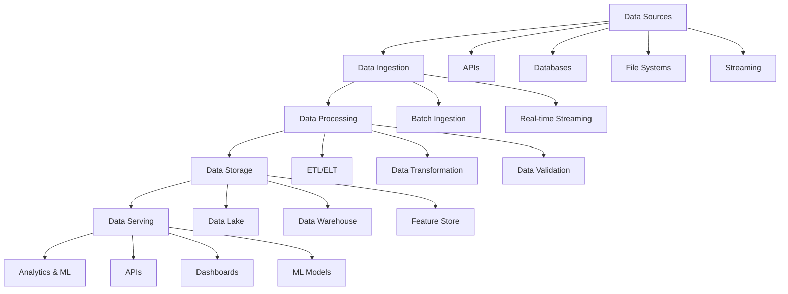

# Data Engineering Fundamentals: Building Robust Data Pipelines

Data engineering forms the backbone of modern data-driven organizations, transforming raw data into actionable insights. This comprehensive guide covers the essential concepts, tools, and best practices for building scalable data infrastructure.

## Data Engineering Overview

### The Modern Data Stack



### Key Data Engineering Principles

1. **Scalability**: Handle growing data volumes
2. **Reliability**: Ensure data consistency and availability
3. **Efficiency**: Optimize performance and costs
4. **Maintainability**: Build sustainable, observable systems
5. **Security**: Protect sensitive data throughout the pipeline

## ETL vs ELT Patterns

### Traditional ETL (Extract, Transform, Load)

```python
# ETL Pipeline Example with Apache Airflow
from airflow import DAG
from airflow.operators.python_operator import PythonOperator
from airflow.operators.bash_operator import BashOperator
from datetime import datetime, timedelta
import pandas as pd
import psycopg2

default_args = {
    'owner': 'data-team',
    'depends_on_past': False,
    'start_date': datetime(2024, 1, 1),
    'email_on_failure': True,
    'retries': 2,
    'retry_delay': timedelta(minutes=5)
}

dag = DAG(
    'sales_etl_pipeline',
    default_args=default_args,
    description='Daily sales data ETL pipeline',
    schedule_interval='@daily',
    catchup=False
)

def extract_sales_data(**context):
    """Extract data from multiple sources"""
    # Extract from API
    api_data = extract_from_api()

    # Extract from database
    db_data = extract_from_database()

    # Extract from CSV files
    file_data = extract_from_files()

    return {
        'api_data': api_data,
        'db_data': db_data,
        'file_data': file_data
    }

def transform_sales_data(**context):
    """Transform and clean the data"""
    raw_data = context['task_instance'].xcom_pull(task_ids='extract_data')

    # Data cleaning and transformation
    df_api = pd.DataFrame(raw_data['api_data'])
    df_db = pd.DataFrame(raw_data['db_data'])
    df_file = pd.DataFrame(raw_data['file_data'])

    # Standardize columns
    df_api = standardize_columns(df_api)
    df_db = standardize_columns(df_db)
    df_file = standardize_columns(df_file)

    # Data quality checks
    validate_data_quality(df_api)
    validate_data_quality(df_db)
    validate_data_quality(df_file)

    # Combine datasets
    combined_df = pd.concat([df_api, df_db, df_file], ignore_index=True)

    # Apply business logic transformations
    transformed_df = apply_business_rules(combined_df)

    return transformed_df.to_dict('records')

def load_to_warehouse(**context):
    """Load transformed data to data warehouse"""
    transformed_data = context['task_instance'].xcom_pull(task_ids='transform_data')

    # Load to PostgreSQL data warehouse
    conn = psycopg2.connect(
        host="warehouse.company.com",
        database="analytics",
        user="etl_user",
        password="secure_password"
    )

    df = pd.DataFrame(transformed_data)
    df.to_sql('sales_fact', conn, if_exists='append', index=False)

    conn.close()

# Define tasks
extract_task = PythonOperator(
    task_id='extract_data',
    python_callable=extract_sales_data,
    dag=dag
)

transform_task = PythonOperator(
    task_id='transform_data',
    python_callable=transform_sales_data,
    dag=dag
)

load_task = PythonOperator(
    task_id='load_data',
    python_callable=load_to_warehouse,
    dag=dag
)

# Set task dependencies
extract_task >> transform_task >> load_task
```

### Modern ELT (Extract, Load, Transform)

```sql
-- dbt (data build tool) transformation example
-- models/staging/stg_sales_raw.sql
{{ config(materialized='view') }}

SELECT
    order_id,
    customer_id,
    product_id,
    quantity,
    unit_price,
    order_date,
    CAST(order_date AS DATE) as order_date_only,
    quantity * unit_price as line_total,
    CURRENT_TIMESTAMP as processed_at
FROM {{ source('raw_data', 'sales_transactions') }}
WHERE order_date >= '{{ var("start_date") }}'

-- models/marts/fact_sales.sql
{{ config(
    materialized='incremental',
    unique_key='order_id',
    on_schema_change='fail'
) }}

WITH sales_with_customer AS (
    SELECT
        s.*,
        c.customer_name,
        c.customer_tier,
        c.region
    FROM {{ ref('stg_sales_raw') }} s
    LEFT JOIN {{ ref('dim_customers') }} c
        ON s.customer_id = c.customer_id
),

sales_with_product AS (
    SELECT
        swc.*,
        p.product_name,
        p.category,
        p.cost_price,
        swc.line_total - (swc.quantity * p.cost_price) as profit
    FROM sales_with_customer swc
    LEFT JOIN {{ ref('dim_products') }} p
        ON swc.product_id = p.product_id
)

SELECT * FROM sales_with_product


    WHERE processed_at > (SELECT MAX(processed_at) FROM {{ this }})

```

## Data Pipeline Architecture Patterns

### Lambda Architecture

```python
# Lambda Architecture Implementation
class LambdaArchitecture:
    def __init__(self):
        self.batch_layer = BatchLayer()
        self.speed_layer = SpeedLayer()
        self.serving_layer = ServingLayer()

    def process_data(self, data_stream):
        """Process data through both batch and speed layers"""
        # Batch layer (high latency, high accuracy)
        batch_future = self.batch_layer.process_async(data_stream)

        # Speed layer (low latency, approximate results)
        real_time_result = self.speed_layer.process(data_stream)

        return real_time_result

class BatchLayer:
    def __init__(self):
        self.spark = SparkSession.builder.appName("BatchProcessing").getOrCreate()

    def process_async(self, data):
        """Process data in batch with Apache Spark"""
        df = self.spark.read.json(data)

        # Complex aggregations and joins
        result = df.groupBy("user_id", "date") \
                  .agg(
                      sum("purchase_amount").alias("total_spent"),
                      count("transaction_id").alias("transaction_count"),
                      avg("item_price").alias("avg_item_price")
                  )

        # Write to batch views
        result.write.mode("overwrite").saveAsTable("batch_user_metrics")

        return result

class SpeedLayer:
    def __init__(self):
        self.kafka_consumer = KafkaConsumer('transactions')
        self.redis_client = redis.Redis()

    def process(self, data):
        """Real-time processing with Redis"""
        for message in self.kafka_consumer:
            transaction = json.loads(message.value)

            # Update real-time counters
            user_key = f"user:{transaction['user_id']}:today"
            self.redis_client.hincrby(user_key, "total_spent", transaction["amount"])
            self.redis_client.hincrby(user_key, "transaction_count", 1)

            # Set TTL for daily metrics
            self.redis_client.expire(user_key, 86400)  # 24 hours
```

### Kappa Architecture

```python
# Kappa Architecture with Apache Kafka Streams
from kafka import KafkaProducer, KafkaConsumer
from kafka.errors import KafkaError
import json

class KappaProcessor:
    def __init__(self):
        self.producer = KafkaProducer(
            bootstrap_servers='localhost:9092',
            value_serializer=lambda v: json.dumps(v).encode('utf-8')
        )

    def process_stream(self, input_topic, output_topic):
        """Process streaming data with Kafka Streams"""
        consumer = KafkaConsumer(
            input_topic,
            bootstrap_servers='localhost:9092',
            value_deserializer=lambda m: json.loads(m.decode('utf-8'))
        )

        for message in consumer:
            # Process each message
            processed_data = self.transform_message(message.value)

            # Send to output topic
            self.producer.send(output_topic, processed_data)

    def transform_message(self, data):
        """Transform streaming data"""
        # Add timestamp
        data['processed_at'] = datetime.utcnow().isoformat()

        # Calculate derived fields
        if 'quantity' in data and 'unit_price' in data:
            data['total_amount'] = data['quantity'] * data['unit_price']

        # Data enrichment
        data['enriched_info'] = self.enrich_data(data)

        return data
```

## Stream Processing

### Apache Kafka Setup

```yaml
# docker-compose.yml for Kafka cluster
version: "3.8"
services:
  zookeeper:
    image: confluentinc/cp-zookeeper:latest
    environment:
      ZOOKEEPER_CLIENT_PORT: 2181
      ZOOKEEPER_TICK_TIME: 2000

  kafka:
    image: confluentinc/cp-kafka:latest
    depends_on:
      - zookeeper
    ports:
      - "9092:9092"
    environment:
      KAFKA_BROKER_ID: 1
      KAFKA_ZOOKEEPER_CONNECT: zookeeper:2181
      KAFKA_ADVERTISED_LISTENERS: PLAINTEXT://localhost:9092
      KAFKA_OFFSETS_TOPIC_REPLICATION_FACTOR: 1

  kafka-ui:
    image: provectuslabs/kafka-ui:latest
    depends_on:
      - kafka
    ports:
      - "8080:8080"
    environment:
      KAFKA_CLUSTERS_0_NAME: local
      KAFKA_CLUSTERS_0_BOOTSTRAPSERVERS: kafka:9092
```

### Apache Spark Streaming

```python
# PySpark Streaming Example
from pyspark.sql import SparkSession
from pyspark.sql.functions import *
from pyspark.sql.types import *

# Create Spark session
spark = SparkSession.builder \
    .appName("StreamingAnalytics") \
    .config("spark.jars.packages", "org.apache.spark:spark-sql-kafka-0-10_2.12:3.4.0") \
    .getOrCreate()

# Define schema for incoming data
schema = StructType([
    StructField("user_id", StringType(), True),
    StructField("event_type", StringType(), True),
    StructField("timestamp", TimestampType(), True),
    StructField("properties", MapType(StringType(), StringType()), True)
])

# Read from Kafka
kafka_stream = spark.readStream \
    .format("kafka") \
    .option("kafka.bootstrap.servers", "localhost:9092") \
    .option("subscribe", "user_events") \
    .load()

# Parse JSON and apply schema
parsed_stream = kafka_stream \
    .select(from_json(col("value").cast("string"), schema).alias("data")) \
    .select("data.*")

# Windowed aggregations
windowed_counts = parsed_stream \
    .withWatermark("timestamp", "10 minutes") \
    .groupBy(
        window(col("timestamp"), "5 minutes", "1 minute"),
        col("event_type")
    ) \
    .count()

# Write to console (for testing)
query = windowed_counts.writeStream \
    .outputMode("append") \
    .format("console") \
    .trigger(processingTime="30 seconds") \
    .start()

query.awaitTermination()
```

## Data Quality and Validation

### Great Expectations Implementation

```python
# Data quality validation with Great Expectations
import great_expectations as ge
from great_expectations.dataset import PandasDataset

class DataQualityValidator:
    def __init__(self):
        self.context = ge.DataContext()

    def validate_sales_data(self, df):
        """Validate sales data quality"""
        # Convert to Great Expectations dataset
        ge_df = PandasDataset(df)

        # Define expectations
        expectations = [
            # Column presence
            ge_df.expect_column_to_exist("order_id"),
            ge_df.expect_column_to_exist("customer_id"),
            ge_df.expect_column_to_exist("order_date"),
            ge_df.expect_column_to_exist("total_amount"),

            # Data types
            ge_df.expect_column_values_to_be_of_type("order_id", "object"),
            ge_df.expect_column_values_to_be_of_type("total_amount", "float64"),

            # Value constraints
            ge_df.expect_column_values_to_be_between("total_amount", 0, 10000),
            ge_df.expect_column_values_to_not_be_null("customer_id"),

            # Uniqueness
            ge_df.expect_column_values_to_be_unique("order_id"),

            # Date validation
            ge_df.expect_column_values_to_be_between(
                "order_date",
                min_value="2020-01-01",
                max_value="2025-12-31"
            ),

            # Custom business rules
            ge_df.expect_column_values_to_match_regex(
                "order_id",
                r"^ORD-\d{8}$"  # Format: ORD-12345678
            )
        ]

        # Validate all expectations
        validation_results = []
        for expectation in expectations:
            validation_results.append(expectation)

        return self.generate_report(validation_results)

    def generate_report(self, results):
        """Generate data quality report"""
        passed = sum(1 for r in results if r.success)
        total = len(results)

        report = {
            "total_checks": total,
            "passed_checks": passed,
            "failed_checks": total - passed,
            "success_rate": passed / total * 100,
            "details": results
        }

        return report

# Data profiling
def profile_dataset(df):
    """Generate data profile report"""
    profile_report = {
        "row_count": len(df),
        "column_count": len(df.columns),
        "missing_values": df.isnull().sum().to_dict(),
        "data_types": df.dtypes.to_dict(),
        "numeric_summary": df.describe().to_dict(),
        "categorical_summary": {}
    }

    # Categorical columns analysis
    for col in df.select_dtypes(include=['object']).columns:
        profile_report["categorical_summary"][col] = {
            "unique_values": df[col].nunique(),
            "most_frequent": df[col].mode().iloc[0] if not df[col].empty else None,
            "frequency": df[col].value_counts().head(10).to_dict()
        }

    return profile_report
```

### Data Lineage Tracking

```python
# Data lineage tracking system
class DataLineageTracker:
    def __init__(self):
        self.lineage_graph = {}

    def track_transformation(self, input_datasets, output_dataset, transformation_logic):
        """Track data transformation lineage"""
        lineage_record = {
            "timestamp": datetime.utcnow().isoformat(),
            "inputs": input_datasets,
            "output": output_dataset,
            "transformation": transformation_logic,
            "metadata": {
                "row_count_input": sum(ds["row_count"] for ds in input_datasets),
                "row_count_output": output_dataset["row_count"],
                "processing_time": None  # To be filled
            }
        }

        self.lineage_graph[output_dataset["name"]] = lineage_record

    def get_upstream_dependencies(self, dataset_name):
        """Get all upstream dependencies for a dataset"""
        dependencies = []

        def traverse_upstream(name):
            if name in self.lineage_graph:
                record = self.lineage_graph[name]
                for input_ds in record["inputs"]:
                    dependencies.append(input_ds["name"])
                    traverse_upstream(input_ds["name"])

        traverse_upstream(dataset_name)
        return list(set(dependencies))

    def get_downstream_impact(self, dataset_name):
        """Get all datasets affected by changes to this dataset"""
        affected = []

        for output_name, record in self.lineage_graph.items():
            input_names = [ds["name"] for ds in record["inputs"]]
            if dataset_name in input_names:
                affected.append(output_name)

        return affected
```

## Data Warehousing

### Dimensional Modeling

```sql
-- Star schema example for e-commerce analytics

-- Fact table
CREATE TABLE fact_sales (
    sale_id BIGSERIAL PRIMARY KEY,
    customer_key INTEGER REFERENCES dim_customer(customer_key),
    product_key INTEGER REFERENCES dim_product(product_key),
    date_key INTEGER REFERENCES dim_date(date_key),
    store_key INTEGER REFERENCES dim_store(store_key),

    -- Measures
    quantity INTEGER NOT NULL,
    unit_price DECIMAL(10,2) NOT NULL,
    discount_amount DECIMAL(10,2) DEFAULT 0,
    tax_amount DECIMAL(10,2) NOT NULL,
    total_amount DECIMAL(10,2) NOT NULL,

    -- Metadata
    created_at TIMESTAMP DEFAULT CURRENT_TIMESTAMP,
    updated_at TIMESTAMP DEFAULT CURRENT_TIMESTAMP
);

-- Customer dimension
CREATE TABLE dim_customer (
    customer_key SERIAL PRIMARY KEY,
    customer_id VARCHAR(50) UNIQUE NOT NULL,
    customer_name VARCHAR(200) NOT NULL,
    email VARCHAR(255),
    phone VARCHAR(20),
    birth_date DATE,
    gender VARCHAR(10),

    -- Address information
    address_line1 VARCHAR(255),
    address_line2 VARCHAR(255),
    city VARCHAR(100),
    state VARCHAR(100),
    postal_code VARCHAR(20),
    country VARCHAR(100),

    -- Customer segmentation
    customer_tier VARCHAR(20),
    lifetime_value DECIMAL(12,2),

    -- SCD Type 2 fields
    effective_date DATE NOT NULL,
    expiration_date DATE,
    is_current BOOLEAN DEFAULT TRUE,

    -- Metadata
    created_at TIMESTAMP DEFAULT CURRENT_TIMESTAMP,
    updated_at TIMESTAMP DEFAULT CURRENT_TIMESTAMP
);

-- Product dimension
CREATE TABLE dim_product (
    product_key SERIAL PRIMARY KEY,
    product_id VARCHAR(50) UNIQUE NOT NULL,
    product_name VARCHAR(255) NOT NULL,
    description TEXT,

    -- Product hierarchy
    category_level1 VARCHAR(100),
    category_level2 VARCHAR(100),
    category_level3 VARCHAR(100),
    brand VARCHAR(100),

    -- Product attributes
    size VARCHAR(50),
    color VARCHAR(50),
    weight DECIMAL(8,2),
    unit_of_measure VARCHAR(20),

    -- Pricing
    cost_price DECIMAL(10,2),
    list_price DECIMAL(10,2),

    -- Status
    is_active BOOLEAN DEFAULT TRUE,

    -- SCD Type 2 fields
    effective_date DATE NOT NULL,
    expiration_date DATE,
    is_current BOOLEAN DEFAULT TRUE
);

-- Date dimension
CREATE TABLE dim_date (
    date_key INTEGER PRIMARY KEY,
    full_date DATE UNIQUE NOT NULL,

    -- Date components
    year INTEGER NOT NULL,
    quarter INTEGER NOT NULL,
    month INTEGER NOT NULL,
    day INTEGER NOT NULL,
    day_of_week INTEGER NOT NULL,
    day_of_year INTEGER NOT NULL,
    week_of_year INTEGER NOT NULL,

    -- Date names
    day_name VARCHAR(20) NOT NULL,
    month_name VARCHAR(20) NOT NULL,
    quarter_name VARCHAR(20) NOT NULL,

    -- Business calendar
    is_weekend BOOLEAN NOT NULL,
    is_holiday BOOLEAN DEFAULT FALSE,
    holiday_name VARCHAR(100),

    -- Fiscal calendar
    fiscal_year INTEGER,
    fiscal_quarter INTEGER,
    fiscal_month INTEGER
);
```

### Slowly Changing Dimensions (SCD)

```python
# SCD Type 2 implementation
def update_customer_dimension(new_customer_data):
    """Handle SCD Type 2 updates for customer dimension"""

    for customer in new_customer_data:
        customer_id = customer['customer_id']

        # Get current record
        current_record = get_current_customer_record(customer_id)

        if current_record is None:
            # New customer - insert new record
            insert_new_customer(customer)
        else:
            # Check for changes in tracked attributes
            tracked_attributes = [
                'customer_name', 'email', 'phone', 'address_line1',
                'city', 'state', 'postal_code', 'customer_tier'
            ]

            has_changes = any(
                current_record[attr] != customer.get(attr)
                for attr in tracked_attributes
            )

            if has_changes:
                # Expire current record
                expire_customer_record(current_record['customer_key'])

                # Insert new version
                insert_new_customer_version(customer)
            else:
                # No changes to tracked attributes
                # Update non-tracked attributes only
                update_customer_metadata(customer_id, customer)

def insert_new_customer_version(customer_data):
    """Insert new version of customer record"""
    sql = """
    INSERT INTO dim_customer (
        customer_id, customer_name, email, phone,
        address_line1, city, state, postal_code,
        customer_tier, effective_date, is_current
    ) VALUES (
        %(customer_id)s, %(customer_name)s, %(email)s, %(phone)s,
        %(address_line1)s, %(city)s, %(state)s, %(postal_code)s,
        %(customer_tier)s, CURRENT_DATE, TRUE
    )
    """
    execute_sql(sql, customer_data)

def expire_customer_record(customer_key):
    """Expire current customer record"""
    sql = """
    UPDATE dim_customer
    SET expiration_date = CURRENT_DATE - INTERVAL '1 day',
        is_current = FALSE
    WHERE customer_key = %(customer_key)s
      AND is_current = TRUE
    """
    execute_sql(sql, {'customer_key': customer_key})
```

## Modern Data Stack Tools

### Infrastructure as Code with Terraform

```hcl
# Terraform configuration for AWS data infrastructure
provider "aws" {
  region = "us-west-2"
}

# S3 bucket for data lake
resource "aws_s3_bucket" "data_lake" {
  bucket = "company-data-lake-${random_string.suffix.result}"
}

resource "aws_s3_bucket_versioning" "data_lake_versioning" {
  bucket = aws_s3_bucket.data_lake.id
  versioning_configuration {
    status = "Enabled"
  }
}

# Redshift cluster for data warehouse
resource "aws_redshift_cluster" "analytics_warehouse" {
  cluster_identifier     = "analytics-warehouse"
  database_name         = "analytics"
  master_username       = "admin"
  master_password       = var.redshift_password
  node_type            = "dc2.large"
  number_of_nodes      = 2

  vpc_security_group_ids = [aws_security_group.redshift.id]
  db_subnet_group_name   = aws_redshift_subnet_group.main.name

  skip_final_snapshot = true
}

# Kinesis for real-time streaming
resource "aws_kinesis_stream" "events_stream" {
  name             = "user-events"
  shard_count      = 2
  retention_period = 24

  shard_level_metrics = [
    "IncomingRecords",
    "OutgoingRecords",
  ]
}

# Lambda for stream processing
resource "aws_lambda_function" "stream_processor" {
  filename         = "stream_processor.zip"
  function_name    = "stream-processor"
  role            = aws_iam_role.lambda_role.arn
  handler         = "lambda_function.lambda_handler"
  runtime         = "python3.9"
  timeout         = 60
  memory_size     = 256

  environment {
    variables = {
      REDSHIFT_ENDPOINT = aws_redshift_cluster.analytics_warehouse.endpoint
      S3_BUCKET        = aws_s3_bucket.data_lake.id
    }
  }
}
```

### Data Orchestration with Prefect

```python
# Modern data orchestration with Prefect
from prefect import flow, task
from prefect.blocks.system import Secret
import pandas as pd
import boto3

@task(retries=3, retry_delay_seconds=60)
def extract_from_api(api_endpoint: str):
    """Extract data from API with retry logic"""
    import requests

    response = requests.get(api_endpoint)
    response.raise_for_status()

    return response.json()

@task
def transform_data(raw_data: list):
    """Transform raw data"""
    df = pd.DataFrame(raw_data)

    # Data cleaning
    df = df.dropna()
    df = df.drop_duplicates()

    # Type conversions
    df['created_at'] = pd.to_datetime(df['created_at'])
    df['amount'] = pd.to_numeric(df['amount'])

    # Business logic
    df['amount_category'] = df['amount'].apply(categorize_amount)

    return df

@task
def validate_data(df: pd.DataFrame):
    """Validate data quality"""
    assert len(df) > 0, "Dataset is empty"
    assert df['amount'].min() >= 0, "Negative amounts found"
    assert df['created_at'].max() <= pd.Timestamp.now(), "Future dates found"

    return True

@task
def load_to_warehouse(df: pd.DataFrame):
    """Load data to warehouse"""
    # Get connection details from Prefect blocks
    db_connection = Secret.load("warehouse-connection")

    # Load data
    df.to_sql('transactions', db_connection.get(), if_exists='append')

    return len(df)

@flow(name="daily-etl-pipeline")
def daily_etl_flow():
    """Main ETL flow"""
    # Extract
    raw_data = extract_from_api("https://api.example.com/transactions")

    # Transform
    cleaned_data = transform_data(raw_data)

    # Validate
    validate_data(cleaned_data)

    # Load
    rows_loaded = load_to_warehouse(cleaned_data)

    return f"Successfully loaded {rows_loaded} rows"

# Deploy the flow
if __name__ == "__main__":
    daily_etl_flow.serve(
        name="daily-etl-deployment",
        cron="0 2 * * *"  # Run daily at 2 AM
    )
```

## Performance Optimization

### Spark Optimization

```python
# Spark performance optimization techniques
from pyspark.sql import SparkSession
from pyspark.sql.functions import *

# Optimized Spark session configuration
spark = SparkSession.builder \
    .appName("OptimizedDataProcessing") \
    .config("spark.sql.adaptive.enabled", "true") \
    .config("spark.sql.adaptive.coalescePartitions.enabled", "true") \
    .config("spark.sql.adaptive.skewJoin.enabled", "true") \
    .config("spark.sql.execution.arrow.pyspark.enabled", "true") \
    .config("spark.sql.shuffle.partitions", "200") \
    .getOrCreate()

def optimize_dataframe_operations(df):
    """Apply optimization techniques"""

    # 1. Partition pruning
    df_filtered = df.filter(col("date") >= "2024-01-01")

    # 2. Column pruning - select only needed columns
    df_selected = df_filtered.select("user_id", "amount", "date", "category")

    # 3. Predicate pushdown
    df_optimized = df_selected.filter(col("amount") > 0)

    # 4. Cache frequently used dataframes
    df_optimized.cache()

    # 5. Repartition for better parallelism
    df_repartitioned = df_optimized.repartition(col("date"))

    # 6. Use broadcast joins for small tables
    small_df = spark.read.table("lookup_table")
    broadcast_df = broadcast(small_df)

    result = df_repartitioned.join(broadcast_df, "category")

    return result

# Bucketing for better join performance
def create_bucketed_table():
    """Create bucketed tables for better join performance"""

    df = spark.read.parquet("large_dataset.parquet")

    df.write \
      .mode("overwrite") \
      .option("path", "/data/bucketed_table") \
      .bucketBy(10, "user_id") \
      .sortBy("date") \
      .saveAsTable("bucketed_transactions")
```

## Monitoring and Observability

### Data Pipeline Monitoring

```python
# Comprehensive monitoring for data pipelines
import time
import logging
from prometheus_client import Counter, Histogram, Gauge
from dataclasses import dataclass
from typing import Dict, Any

# Metrics collection
PIPELINE_RUNS = Counter('pipeline_runs_total', 'Total pipeline runs', ['pipeline', 'status'])
PIPELINE_DURATION = Histogram('pipeline_duration_seconds', 'Pipeline duration', ['pipeline'])
DATA_QUALITY_SCORE = Gauge('data_quality_score', 'Data quality score', ['dataset'])
RECORDS_PROCESSED = Counter('records_processed_total', 'Records processed', ['pipeline', 'stage'])

@dataclass
class PipelineMetrics:
    pipeline_name: str
    start_time: float
    records_processed: int = 0
    data_quality_score: float = 0.0
    errors: list = None

    def __post_init__(self):
        if self.errors is None:
            self.errors = []

class DataPipelineMonitor:
    def __init__(self, pipeline_name: str):
        self.pipeline_name = pipeline_name
        self.metrics = PipelineMetrics(
            pipeline_name=pipeline_name,
            start_time=time.time()
        )

    def record_stage_completion(self, stage_name: str, records_count: int):
        """Record completion of a pipeline stage"""
        RECORDS_PROCESSED.labels(
            pipeline=self.pipeline_name,
            stage=stage_name
        ).inc(records_count)

        self.metrics.records_processed += records_count

        logging.info(f"Stage {stage_name} completed: {records_count} records")

    def record_data_quality_score(self, dataset: str, score: float):
        """Record data quality metrics"""
        DATA_QUALITY_SCORE.labels(dataset=dataset).set(score)
        self.metrics.data_quality_score = score

    def record_error(self, error: Exception, stage: str):
        """Record pipeline errors"""
        self.metrics.errors.append({
            'stage': stage,
            'error': str(error),
            'timestamp': time.time()
        })

        logging.error(f"Error in {stage}: {error}")

    def finish_pipeline(self, success: bool):
        """Mark pipeline completion"""
        duration = time.time() - self.metrics.start_time

        PIPELINE_DURATION.labels(pipeline=self.pipeline_name).observe(duration)

        status = 'success' if success else 'failure'
        PIPELINE_RUNS.labels(pipeline=self.pipeline_name, status=status).inc()

        # Send alerts for failures
        if not success:
            self.send_alert()

        logging.info(f"Pipeline {self.pipeline_name} completed: {status} in {duration:.2f}s")

    def send_alert(self):
        """Send alert for pipeline failures"""
        # Integration with alerting systems (Slack, PagerDuty, etc.)
        pass

# Usage example
def monitored_pipeline():
    monitor = DataPipelineMonitor("daily-sales-etl")

    try:
        # Extract stage
        raw_data = extract_sales_data()
        monitor.record_stage_completion("extract", len(raw_data))

        # Transform stage
        cleaned_data = transform_sales_data(raw_data)
        monitor.record_stage_completion("transform", len(cleaned_data))

        # Quality check
        quality_score = validate_data_quality(cleaned_data)
        monitor.record_data_quality_score("sales", quality_score)

        # Load stage
        load_to_warehouse(cleaned_data)
        monitor.record_stage_completion("load", len(cleaned_data))

        monitor.finish_pipeline(success=True)

    except Exception as e:
        monitor.record_error(e, "pipeline")
        monitor.finish_pipeline(success=False)
        raise
```

## Conclusion

Data engineering is a rapidly evolving field that requires a deep understanding of distributed systems, data modeling, and software engineering principles. The modern data stack provides powerful tools for building scalable, reliable data infrastructure.

Key takeaways:

- **Architecture matters**: Choose the right pattern (Lambda, Kappa, etc.) for your use case
- **Data quality is paramount**: Implement comprehensive validation and monitoring
- **Performance optimization**: Understand your tools and optimize for your specific workloads
- **Observability**: Monitor everything and set up proper alerting
- **Scalability**: Design for growth from the beginning

The data engineering landscape continues to evolve with cloud-native solutions, real-time processing capabilities, and AI/ML integration. Stay current with emerging technologies and best practices to build robust data infrastructure that powers data-driven decision making.

---

_Ready to build your data pipeline? Start by identifying your data sources, defining your data model, and choosing the right tools for your specific requirements._
